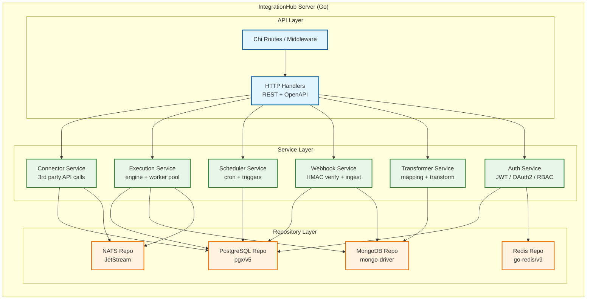

```mermaid
flowchart TB
    classDef api fill:#e1f5fe,stroke:#01579b,stroke-width:2px
    classDef svc fill:#e8f5e9,stroke:#2e7d32,stroke-width:2px
    classDef repo fill:#fff3e0,stroke:#ef6c00,stroke-width:2px
    classDef infra fill:#eceff1,stroke:#455a64,stroke-width:2px

    subgraph Server ["IntegrationHub Server (Go)"]
        direction TB
        subgraph APILayer ["API Layer"]
            Routes[Chi Routes / Middleware]:::api
            Handlers[HTTP Handlers<br/>REST + OpenAPI]:::api
        end

        subgraph ServiceLayer ["Service Layer"]
            ConnectorSvc[Connector Service<br/>3rd party API calls]:::svc
            ExecutorSvc[Execution Service<br/>engine + worker pool]:::svc
            SchedulerSvc[Scheduler Service<br/>cron + triggers]:::svc
            WebhookSvc[Webhook Service<br/>HMAC verify + ingest]:::svc
            TransformerSvc[Transformer Service<br/>mapping + transform]:::svc
            AuthSvc[Auth Service<br/>JWT / OAuth2 / RBAC]:::svc
        end

        subgraph RepositoryLayer ["Repository Layer"]
            PostgresRepo[PostgreSQL Repo<br/>pgx/v5]:::repo
            MongoRepo[MongoDB Repo<br/>mongo-driver]:::repo
            RedisRepo[Redis Repo<br/>go-redis/v9]:::repo
            NATSRepo[NATS Repo<br/>JetStream]:::repo
        end
    end

    Routes --> Handlers
    Handlers --> ConnectorSvc
    Handlers --> ExecutorSvc
    Handlers --> SchedulerSvc
    Handlers --> WebhookSvc
    Handlers --> TransformerSvc
    Handlers --> AuthSvc

    ConnectorSvc --> PostgresRepo
    ConnectorSvc --> NATSRepo
    ExecutorSvc --> PostgresRepo
    ExecutorSvc --> MongoRepo
    ExecutorSvc --> NATSRepo
    SchedulerSvc --> PostgresRepo
    WebhookSvc --> PostgresRepo
    WebhookSvc --> MongoRepo
    TransformerSvc --> MongoRepo
    AuthSvc --> PostgresRepo
    AuthSvc --> RedisRepo
```

**C4 Component Diagram.** Server components: API layer, service layer, repository layer, and their external data-store dependencies.
