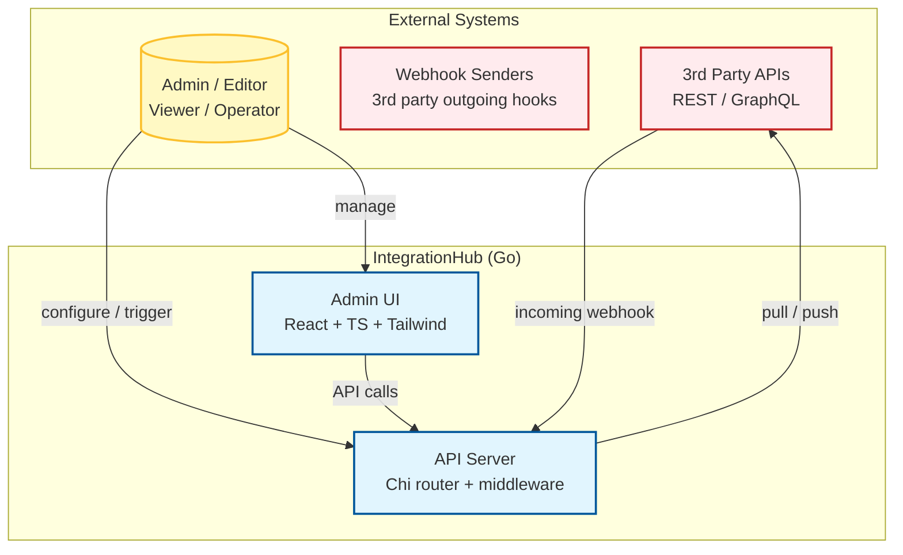

```mermaid
flowchart TB
    classDef system fill:#e1f5fe,stroke:#01579b,stroke-width:2px
    classDef actor fill:#fff9c4,stroke:#fbc02d,stroke-width:2px
    classDef external fill:#ffebee,stroke:#c62828,stroke-width:2px

    subgraph External ["External Systems"]
        direction TB
        ThirdPartyAPI[3rd Party APIs<br/>REST / GraphQL]:::external
        WebhookSender[Webhook Senders<br/>3rd party outgoing hooks]:::external
        AdminUser[(Admin / Editor<br/>Viewer / Operator)]:::actor
    end

    subgraph IntegrationHub ["IntegrationHub (Go)"]
        direction TB
        API[API Server<br/>Chi router + middleware]:::system
        Web[Admin UI<br/>React + TS + Tailwind]:::system
    end

    AdminUser -->|configure / trigger| API
    AdminUser -->|manage| Web
    Web -->|API calls| API
    API -->|pull / push| ThirdPartyAPI
    ThirdPartyAPI -->|incoming webhook| API
```

**C4 Context Diagram.** IntegrationHub system boundary, actors (Admin/Editor/Viewer/Operator), and external systems (3rd party REST/GraphQL APIs, webhook senders).
